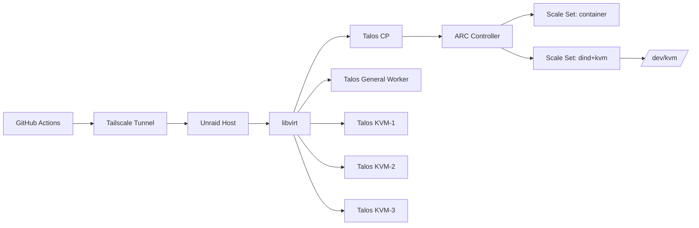

# Architecture Overview

## Topology

## Node Pools

- **General pool**: `nodepool.syscode.dev/type=general`
  - default ARC runners
  - no KVM taint
- **KVM pool**: `nodepool.syscode.dev/type=kvm`, `arc.example.dev/kvm=true`
  - taint: `arc.example.dev/kvm=true:NoSchedule`
  - accepts only explicitly tolerant workloads

## ARC Runtime Split

- Container scale set optimizes cost and simplicity.
- DIND scale set isolates heavier runtime-real jobs.
- Routing is explicit through workflow `runs-on` labels and scale set configuration.

## Autoscaler Design

- Cluster CronJob inspects dind runner pod demand.
- Desired KVM VM count is computed by a deterministic ratio.
- Script executes `virsh start` / `virsh shutdown` over SSH.
- Pool can shrink to zero when idle.
